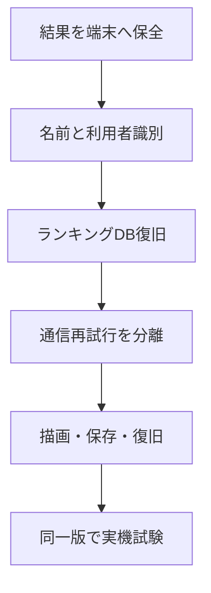

# サイノメ 敵対的検証対応計画

作成日：2026年8月9日  
対象基準：`main`（PR #37 merge後）
更新日：2026年8月14日

進捗：第1〜第10工程完了。第3工程は安全停止状態でDB適用・Unicode一致確認まで完了し、停止後の既発行番号を確定させない補強移行も本番へ適用済みである。拒否分類のクライアント変更はDraft実装済みで、公開有効化前の残課題は引き続き残る。第11工程の診断入口まで実装済みで、実機確認は同じ公開候補版で行う。 PR #43で別タブの保存状態同期までmainへ反映した。実機結果はdocs/RELEASE_ACCEPTANCE_RECORD.mdへ固定版の証拠として記録する。2026年8月16日以降の新規プレイは300秒だけとし、旧60秒・180秒の保存・未送信記録は削除も変換もしない。

品質検査は`.github/workflows/quality.yml`でPR・`main`更新・手動実行へ共通化し、`npm ci`、`npm test`、JavaScript構文検査を同じロック済み依存関係で実行する。これは実機受入の代替ではなく、実機確認を待つ間の回帰検出を継続するための補助である。

## 1. 目的

敵対的検証で確認した公開阻害級の問題を、既存のゲームルール、盤面、得点を保ちながら、300秒の単一モードへ移行して解消する。

完成条件は、ランキングが表示されることだけではない。iPhoneで画面を離れる、通信が切れる、タブが破棄される、WebGLの描画機能が失われる、といった状況でも、正当な結果とプレイ状態を失わず、復帰方法が分かることを含む。

## 2. 対応順の判断

本番DBでは以前、サイノメ用のゲーム登録と得点登録関数が削除されていた。第3工程でv2契約を復旧したが、安全確認が終わるまで受付フラグ、有効化時刻、対象ゲームを停止状態にしているため、現在のランキング送信は成立しない。

ただしDBだけを先に再開すると、送信前または送信結果が不明な時点でページが破棄された場合、正当な記録を再送できない。先に未送信結果を端末へ保存し、名前と利用者識別の契約を固めた後でDBを再開する。

## 3. 守る範囲

- 7×7の3D盤面、サイコロの向き、移動、消去、連鎖を変えない。
- 300秒のルールと得点式を定義する。旧60秒・180秒の新規実行経路は終了し、既存の保存・記録は保全する。
- 新規ランキング表示は300秒の上位10名とし、過去の60秒・180秒未送信記録は元のモードのまま扱う。
- 公開用の接続情報だけをブラウザへ置き、秘密鍵を含めない。
- `main`へ直接変更せず、一工程を一つのDraft PRにする。
- DBの緊急停止は、データ削除ではなくゲームの非公開化と関数権限の停止を基本にする。

## 4. 全11工程

| # | 一つのDraft PRで扱う範囲 | 主な完了条件 | 安全な戻し方 |
|---:|---|---|---|
| 1 | 未送信結果の端末保全 | 結果確定後、通信より先に契約版・クライアント版付きでIndexedDBへ保存する。登録番号の確保・上限判定・完全一致削除を`readwrite`トランザクションで行い、同じ番号を使う別タブ同時処理でも片方だけを受け付ける。再読み込み後も同じ内容と番号で手動再送でき、DB応答との一致確認まで消さない。 | 読み取りと手動再送だけを止める。保存済みデータは削除しない。 |
| 2 | 名前入力修正と利用者識別の契約 | 制御文字、不可視文字だけの名前、見た目が空の名前をブラウザで拒否し、共通の正常・異常例を自動検査へ追加する。DB側にも同じ規則を適用する契約、Supabase Anonymous Authが発行する`auth.uid()`、サーバー発行プレイ番号を設計する。この工程では本番DBへ適用しない。 | ブラウザの安全な入力拒否は残し、匿名ID・プレイ番号の採用だけを見送れるようにする。既存記録を書き換えない。 |
| 3 | Supabaseランキング契約の復旧 | `supabase/migrations/20260810120000_sainome_ranking_v2.sql`とv2クライアントで、工程2のRPC・UID・プレイ番号・冪等性・未検証順位・旧入口遮断をDraft実装する。本番適用後も、名前DB検査のUnicode 15.1全範囲との一致、キャッシュ測定、Turnstile/IP制限、Advisor allowlist確認が終わるまで受付を有効にしない。 | 3ゲームを非公開にし、新RPCの実行権限を取り消す。記録は削除しない。 |
| 4 | 登録再送・順位再読込・隔離復旧 | 登録成功後に順位取得だけ失敗した場合、再試行で得点を再送しない。完全オフライン時に登録と順位取得を直列で最大約16秒待たせない。通信失敗と恒久拒否を分け、拒否1件を隔離して後続を続行する。破損データの非破壊書き出しと確認付き削除、`shared-v1`未検証表示を追加し、新契約へ自動変換しない。 | 送信機能を止めても、工程1の未送信・隔離結果を保持する。 |
| 5 | 3カウントとゲーム開始の分離 | 3D画面の生成では時間を開始しない。3・2・1中はTIMEが300のままで、終了時に一度だけ開始する。 | 画面と開始時刻の差分だけを戻す。保存・DBへ影響させない。 |
| 6 | 非プレイ画面の3D描画停止 | ホーム、説明、結果、画面非表示、描画消失中は継続描画しない。復帰後の描画予約は常に1本にする。 | 描画管理だけを戻し、ゲーム状態を変えない。 |
| 7 | プレイ中状態の保存と復元 | 盤面、全サイコロの向きと状態、現在地、得点、経過時間、生成残数、乱数状態を版付きで保存する。再読み込み後は最後の安全な手から再開する。 | 復元だけを停止し、未知の版の保存値は削除せず無視する。 |
| 8 | WebGL消失時の復旧と退避 | カウント中・プレイ中とも停止する。復元できれば資源を作り直し、できなければ「再生成」「ホームへ」を表示する。結果は工程1・7から回収できる。 | 自動再生成を止めても、保存地点からホームへ退避する経路を残す。 |
| 9 | iOS音声の中断復帰 | 一時停止だけでなく中断・終了状態を扱う。次の明示的なタップで再開し、重複再生しない。設定を勝手に変更しない。 | 効果音だけを無効化できる。ゲーム進行は続ける。 |
| 10 | 動きを減らす設定と振動 | 端末の設定に応じ、装飾用の無限アニメーション、点滅、拡縮、振動を止める。盤面変化の意味は残す。 | 緊急時は常に動き少なめの状態へ固定する。 |
| 11 | 同一公開候補版の実機試験 | iPhone 17 Pro、iPhone 11 Pro、iPad Pro 2018で、30分、再戦10回、画面離脱と復帰10回、低速・切断・再接続、ブラウザ終了・タブ破棄後の復元、WebGL強制消失10回、音声中断、動きを減らす設定、振動停止を確認する。発熱と描画資源・イベント数が周回ごとに増えず、iPhone縦画面で未送信パネルを含め見切れないことを、同じコミットで3回連続確認する。 | 失敗した工程の公開判定を止める。DBは先に受付停止してからコードを戻す。 |

## 5. 第1工程の仕様

### 保存する内容

- 保存形式の版
- ランキング受付契約の版と、結果確定時のクライアント版
- 同じ結果を識別する登録番号
- ランキング名
- 300秒モード（旧保存は元のモードを保全）
- 得点、消去数、最大連鎖、終了理由
- 結果を確定した時刻

1件をIndexedDBの1レコードへ保存する。登録番号の取得、同じ番号との比較、件数上限、追加、完全一致削除を同じ`readwrite`トランザクションで行い、別タブの処理と原子的に直列化する。保存件数には上限を設けるが、上限到達時に古い未送信結果を勝手に捨てない。新しい結果を保存できなかった場合は通信開始前から結果画面へ警告を残す。

破損した保存値はそのレコードのまま保全し、再送しない。他の正常な記録と新しい記録は処理を継続する。工程4で非破壊書き出し、確認付き削除、未検証記録の隔離表示を実装し、無断で初期化しない。

IndexedDBは通信障害やタブ破棄に備える可用性用キューであり、プレイの証拠、認証情報、改ざん防止機構ではない。同じoriginのスクリプトから変更できるため、ランキングの真正性はサーバー発行情報とDB検査で確保する。

### 処理順

1. ゲーム結果を一度だけ確定する。
2. 登録番号を作り、未送信結果を端末へ保存する。
3. 保存成否を画面側へ渡す。
4. ランキング通信を開始する。
5. DB応答が1行だけで、受付済み、登録番号、契約版、クライアント版、slug、名前、送信得点が要求と一致した場合だけ次へ進む。IndexedDBの同一トランザクション内で、登録番号・契約版・クライアント版・名前・結果・確定時刻を含む保存全体が不変であることを再確認して削除する。
6. 再読み込み時は保存済み結果を検査し、正常なものだけ同じ番号と元のクライアント版で手動再送できるようにする。DB契約が復旧する工程3までは、起動時・オンライン復帰時の自動再送を行わない。

### 契約更新後の保全済み記録

第1工程の`shared-v1`記録には、将来のサーバー発行プレイ番号がない。新契約へ黙って読み替えたり、検証済みランキングとして公開したりしない。工程4の画面で元データと契約版を残したまま「未検証」と表示し、管理者審査へ渡すために書き出すか、確認後に削除するかを選べるようにする。新契約の公開受付は、対応クライアントの配備とDB側の契約版確認が揃ってから有効にする。

### 第1工程の自動検査

- 保存後に新しい管理クラスを作り直しても、登録番号と結果が一致する。
- 通信前には保存済みで、受付成功前には削除されない。
- 受付成功後だけ対象の1件を削除する。
- 同じ登録番号を再追加しても件数を増やさない。
- 同じ登録番号を別内容へ使い回した場合は拒否する。
- 同時に開いた複数タブが別記録を追加しても両方残り、一方の受付削除が他方を消したり復活させたりしない。
- 同じ登録番号へ別内容を同時追加した場合は、IndexedDBトランザクションで片方だけが番号を確保し、他方は新しい番号を作り直す。
- 実際のIndexedDB保存クラスを同じDB名で2つ生成し、同時追加、再接続、不一致削除、完全一致削除、トランザクション完了後の応答を確認する。
- 壊れたJSON、未知の版、範囲外の得点・モード・名前を再送しない。
- 必須の確定時刻・終了理由・契約版・クライアント版が欠けた値を補完せず拒否する。
- 保存不能、削除不能、件数上限で、既存の未送信結果を削除しない。
- 模擬保存と模擬通信を実行し、保存、送信、受付確認、完全一致する対象の削除という順序を確認する。
- 古いプレイの保存や通信が遅れて完了しても、後から始めた現行プレイの結果表示を変更しない。
- 手動再送ボタンを待機中に連打しても、同じ未送信記録の通信を同時に二重起動しない。

## 6. 第2工程で確定した契約

名前は`player-name-v1`、Unicode 15.1.0、NFKC、正規化後1〜20コードポイントで固定する。ブラウザ実行環境のUnicode版には依存せず、`js/player-name-unicode-15-1.js`の固定データと`contracts/player-name-v1.json`の共通例をブラウザ・将来DBの双方で使う。入力時の`canonicalize(raw)`だけが正規化し、保存・再送・通信・DB境界の`acceptCanonical(value)`では正規形との完全一致を要求する。共通例は、生入力の正規化結果と、正規形だけを受け付けるDB境界を分けて検査する。

将来のランキング受付契約は`shared-v1`と分離した`sainome-play-v2`、初期クライアント版は`sainome-web-2`とする。3カウント前にDBがプレイ番号を発行し、JWTの`auth.uid()`、モード、正規名、クライアント版、契約版、DB時刻へ結合する。初期値は受付期限24時間、最短受付は発行から303秒（旧契約の値は既存記録の検査用に保持）、未消費10件/UID、rolling 60分で発行60件/UIDとし、判定と発行をUID単位で直列化する。既存`shared-v1`を変換・再発行・公開順位へ自動登録しない。

表示名は重複可能で、本人識別へ使わない。非公開のUID対応から内部キーを割り当て、ランキングRPCが返す`is_current_user`だけで本人行を示す。ブラウザへUIDや内部キーを返さない。発行・確定・読取RPCの完全一致シグネチャ、返却列、判定順序、権限、同時実行検査は`docs/RANKING_IDENTITY_CONTRACT.md`を規範とする。

### 第3工程Draft実装の状態

- `js/supabase-auth.js`はAnonymous Authの既存セッションを再利用し、期限切れ時はrefreshを試す。確定再送では新しい匿名UIDを作らない。
- `js/ranking-client.js`は開始前にサーバー発行UUIDを取得し、発行失敗時はそのプレイを遡及登録しない。ランキング行は`verification_status='unverified'`だけを表示する。
- `supabase/migrations/20260810120000_sainome_ranking_v2.sql`は専用private台帳、UID対応、モード別集計、RLS、権限撤回、旧RPCのslugガード、3つの非公開ゲームを追加する。ただし`accepting_runs=false`、`ranking_enable_not_before='infinity'`、`public.games.is_active=false`で、本番受付は開かない。
- `supabase/migrations/20260813032103_harden_sainome_ranking_submission_contract.sql`は、発行・確定RPCを同じ公開署名のまま置き換える。
- `supabase/migrations/20260816090000_sainome_300_seconds.sql`は新規300秒slug、ゲーム行、制約、発行・確定・読取RPCへ300秒の許可値を追加する。既存ゲートは停止状態を維持する。未確定番号は設定行→ゲーム行→UID対応行の順にロックして受付状態を再確認し、受付済み完全一致再送だけは停止後も返す。受付状態は有効化しない。
- DB名前検査はブラウザのUnicode 15.1固定範囲、Script、Emoji列挙と一致確認済みである。実測キャッシュ寿命、Turnstile、Advisor allowlistを確認するまで公開受付は有効化しない。

### 第3工程の本番DB適用後の確認

- sainome_ranking_v2_contractを本番へ適用した。移行履歴、専用private台帳のRLS、公開ロールの表権限、v2 RPCの実行権限を読み取り専用で確認した。
- `supabase/migrations/20260811090000_sainome_unicode_name_contract.sql`を本番へ追加適用した。ブラウザ固定データの範囲・Script・Emoji列挙をDBへ移し、Unicode 15.1の名前検査を同じ判定順へ統一した。
- private.sainome_v2_config.accepting_runs=false、ranking_enable_not_before=infinity、3つのpublic.games.is_active=falseを確認した。受付開始や既存記録の変換は行っていない。
- Unicode 15.1の未割り当て文字U+1C89をDBが禁止範囲として扱うこと、ブラウザとDBの固定件数・共通例が一致することを確認した。本番受付停止中のため公開記録への影響はない。
- 移行後もセキュリティ・性能Advisorを実行した。RLS未設定ポリシー、実行権限、既存インデックスなどの既知・想定警告は残っているため、allowlist整理と公開判定は未完了である。本番受付停止条件を維持している。
- 停止契約補強移行を本番履歴`20260813033722`として適用した。関数定義、`SECURITY DEFINER`、空の`search_path`、`authenticated`だけの実行権限、設定→ゲーム→UID対応のロック順、停止フラグの維持を確認した。ロールバック付き実行確認では、停止中の発行が`PT503`、利用不能番号が`PT410`となり、台帳・集計は0件のままである。Advisorは適用前後で増減していない。

### 第4工程実装の状態

- `js/ranking-client.js`がHTTP状態・タイムアウト・ネットワーク切断を再試行可能性付きで返し、恒久拒否と区別する。
- `js/ranking-client.js`はPostgRESTのRPC名とエラーコードを画面表示とは分けて保持する。`submit_score_once`の`PT410`は再送不能、`PT425`と`PT503`は再送可能、`PT409`は内容不一致の恒久拒否として扱う。サーバーのエラー文は画面へ直接表示しない。
- 登録成功後の順位取得失敗は、結果画面の「ランキングを再読込」だけで再試行し、得点登録RPCを再送しない。オフライン時は送信前に停止し、登録と順位取得を直列に待たせない。
- IndexedDBをv2へ更新し、未送信記録とは別の隔離ストアへ恒久拒否を一件ずつ完全一致で移す。再送処理は後続の未送信記録を続ける。
- 破損記録と旧`shared-v1`記録は元のシリアル化値を変更せず、保全データとして書き出せる。削除は書き出し確認後の明示操作と完全一致確認を必要とし、旧契約から新契約への自動変換・自動再送は行わない。
- 第4工程の自動検査を含め、`npm test`は287件全件成功した。DB受付とゲーム公開状態は停止したままである。

### 第5工程実装の状態

- `WebGLSainome.reset()`は盤面、プレイヤー、モード、ゲーム状態を準備するが、ゲーム時間を開始しない。準備中のセッションは`idle`で、300秒の初期残り時間（旧保存は元のモード）を保つ。
- `main.js`はサーバー発行番号の取得と盤面準備を3カウントの前に行う。カウント中は画面操作を受け付けず、ゲームセッションも進めない。
- 3カウントが完了した瞬間だけ`startSession()`を呼ぶ。開始対象が`idle`でない場合は開始を拒否し、二重開始を防ぐ。
- 第5工程の自動検査を含め、`npm test`は289件全件成功した。DB受付とゲーム公開状態は停止したままである。

### 第6工程Draft実装の状態

- `WebGLSainome`はホーム・説明・結果では描画ループを開始せず、3カウントとプレイ中だけ描画する。
- 画面非表示またはWebGL描画機能の消失時は保留中の描画予約を取り消し、復帰時に対象画面なら1本だけ再予約する。
- 移動・転がりの補間も共通の描画予約へ集約し、画面復帰や結果画面への遷移で複数の`requestAnimationFrame`ループが残らないようにする。
- 第6工程の自動検査を含め、`npm test`は295件全件成功した。DB受付とゲーム公開状態は停止したままである。

### 第7工程Draft実装の状態

- `js/game-state-storage.js`がランキング保存領域と分離した`active-play-v1`へ、版付きのプレイ状態を1件だけ保存する。IndexedDBを優先し、存在していても開けない・途中で使えない場合は`localStorage`へ切り替える。切り替え先に対象がない削除は成功扱いにせず、保存を残す。
- 保存値はモード、時間、得点、消去数、連鎖、盤面上の全サイコロの面・位置・状態・アニメーション経過、プレイヤー位置、生成残数、乱数状態、発行済みプレイ番号を検査する。未知の版、面の矛盾、重複位置、範囲外の値は復元せず、元のシリアル化値を削除しない。
- `WebGLSainome`は移動・転がりの処理中やアニメーション予約が残る間は保存せず、最後に完了した安全地点だけを保存する。移動がない時間も約1秒ごとに安全地点を更新する。`GameRandom`の状態を戻すことで、復元後の生成候補とサイコロ向きを同じ乱数列から続行する。
- 起動後に保存を確認できるとホームへ「続きから再開」を表示し、明示的な「保存を削除」と完全一致確認を使う。ゲーム開始時にも保存領域を再確認し、別タブで作られた保存や起動後に発生したI/O障害を古い起動時結果のまま扱わない。保存が初めて作られた時と削除された時は別タブへ通知し、ホーム画面だけが復旧状態を読み直す。保存を確認できない場合は上書きせず、新規開始も先に削除を要求する。保存領域のI/O障害は破損値と混同しない。
- `GameSession.restore()`と`GameFlow.resumePlaying()`で3カウントをやり直さず再開し、終了時は状態保存を削除する。ランキングの受付停止条件とSupabase本番DBは変更していない。
- 第7工程の自動検査を含め、`npm test`は348件全件成功した。IndexedDBの実行時失敗からlocalStorageへ切り替える経路、切り替え先が空でも保存なしとみなさず復旧後に再確認する経路、保存I/O失敗を成功扱いにしない経路を検査した。DB受付とゲーム公開状態は停止したままである。iOSのタブ破棄、WebGL消失、発熱、実際のIndexedDB可用性は第11工程で確認する。

### 第8工程Draft実装の状態

- `webglcontextlost`発生時は、シミュレーション時間、3カウント、入力、描画予約を止め、プレイ中なら最後の安全地点を第7工程の保存領域へ残す。
- Three.jsの復元イベント後に、内部状態のリセット、サイズ・カメラの再設定、シーンの再描画を行い、GPU資源の再登録を確認できた場合だけ同じ画面へ戻す。復元不能時はカウントやプレイを再開しない。
- 自動復元を5秒待っても戻らない場合は、保存地点を残したまま「3D表示を再生成」「ホームへ」を表示する。再生成はキャンバスとゲームインスタンスを作り直し、プレイ中は工程7の保存状態を復元し、カウント中は現在のカウントから続ける。
- 「ホームへ」は保存処理を壊さず、古いWebGLインスタンスのイベント・ResizeObserver・描画資源を破棄してから新しいキャンバスへ置き換える。ホームからの次回開始時も、既に消失したインスタンスを再利用しない。
- 第8工程の自動検査を含め、`npm test`は313件全件成功した。DB受付とゲーム公開状態は停止したままである。実際のWebGL強制消失、iOSのタブ破棄、発熱、描画資源の周回増加は第11工程で確認する。

### 第9工程Draft実装の状態

- `SoundEffects`は`AudioContext`の`statechange`を監視し、`suspended`、iOS Safariで使われる`interrupted`、`closed`を区別して扱う。音声が動作中でなくなったときは、残っている音源を停止し、古い音を復帰後に重ねて再生しない。
- `interrupted`と`suspended`は画面復帰や状態変化だけで自動再開せず、次の明示操作から呼ばれる`unlock()`で一度だけ`resume()`する。同時に複数の操作が来ても、同じ復帰処理を二重に実行しない。
- `closed`になった音声コンテキストはイベント登録、音源、マスター音量を解放する。次の明示操作で新しいコンテキストを作り、保存済みの音声設定は変更しない。
- 音声をオンにできない場合も、ゲーム設定を勝手にオフへ戻さない。音声だけを無音にし、ゲーム進行と入力は続ける。
- 第9工程の自動検査を含め、`npm test`は317件全件成功した。DB受付とゲーム公開状態は停止したままである。実際のiOS音声中断・電話や他アプリによる割り込み・復帰後の聴感は第11工程で確認する。

### 第10工程Draft実装の状態

- `MotionPreferences`は、端末の`prefers-reduced-motion`設定を読み取り、設定が途中で変わった場合も画面へ反映する。`matchMedia`が使えない環境では通常の動きを保ち、ゲームを止めない。
- CSSの無限アニメーション、点滅、拡縮に加え、3Dプレイヤーの装飾的な上下揺れと傾きも、端末設定が有効な間は完全に停止する。カウントの数字、得点、残り時間、盤面の変化といった意味のある表示は残す。
- 盤面の衝突時に使う振動は、同じ端末設定が有効な間は呼び出さない。設定が無効な場合だけ、既存の短い振動を使う。
- 第10工程の自動検査を含め、`npm test`は324件全件成功した。初期設定の読み取り、設定変更の反映、監視解除、CSS停止指定、3D装飾の抑止、装飾クラスの抑止、振動の設定判定を確認している。DB受付とゲーム公開状態は停止したままにする。

### 第11工程の実機試験補助Draft実装の状態

- 通常URLでは表示せず、`?sainome-test=release`を付けた試験用URLだけに診断パネルを出す。ゲーム中にWebGLの`WEBGL_lose_context`拡張へ接続し、強制消失と復元を実行できる。
- 強制消失後は既存の`webglcontextlost`、自動復元待機、復元不能時の再生成・ホーム退避を通る。診断パネルは、消失状態、描画フレーム、描画予約、サイコロ数、シーン内の物体数、GPU形状・テクスチャ数、アニメーション予約数を表示する。
- 診断機能はゲームの通常URLでは無効で、ランキング受付状態、ゲームルール、得点、時間、保存内容を変更しない。実機の発熱、タブ破棄、音声割り込み、通信断、3回連続合格は、引き続き手動確認が必要である。
- 実機の各回はdocs/RELEASE_ACCEPTANCE_RECORD.mdへ候補版SHA、端末・OS・ブラウザ、試験項目、診断値、合否を記録する。空欄や未実施を合格に読み替えず、3端末×3回の連続合格が揃うまで第11工程を完了扱いにしない。

## 8. ランキングDB復旧時の安全条件

工程3では、現在の削除移行を編集せず、新しい移行を追加する。

- `sainome_300_seconds`を新規プレイ用に登録し、`sainome_60_seconds`と`sainome_180_seconds`は旧記録の保全用に残す。
- `issue_sainome_play_v2(text,text,text,text)`を追加し、`sainome-web-2`と`sainome-play-v2`だけへ、DB生成番号、要求値、発行・最短受付・失効時刻を一行で返す。
- クライアントが要求する`submit_score_once(text,text,integer,text,text,text)`を追加する。引数は順に`p_display_name`、`p_game_slug`、`p_score`、`p_client_version`、`p_submission_id`、`p_contract_version`とする。
- `get_sainome_ranking_v2(text,integer)`を追加し、UIDと内部キーを除いた順位、表示名、得点、回数、本人真偽値、`unverified`だけを返す。
- 読取RPCは既定権限を取り消した後、`anon`と`authenticated`だけへ実行を許可する。
- 非公開スキーマにプレイ発行・重複防止台帳を置き、同一番号・同一内容の再送は保存済み集計結果を返し、`was_duplicate`だけをtrueにする。
- 受付済み完全一致再送は停止後・期限後も保存済み結果を返す。未確定番号は受付停止、有効化時刻前、ゲーム無効の間は確定せず`PT503`で残す。期限切れ・利用不能番号は`PT410`、内容不一致は`PT409`、早すぎる送信は`PT425`とする。
- サイノメv2の利用者対応とモード別集計は非公開スキーマへ分離し、`(player_key, game_slug)`を一意にして原子的にupsertする。既存の公開得点表へサイノメv2行を混ぜない。
- 非公開台帳、UID対応、v2集計はRLSを有効にし、公開用ポリシーを作らず、公開ロールへ表権限を与えない。
- 同一番号・異なる内容は拒否する。
- 3ゲームを有効化する前に、既存の公開`submit_score(text,text,integer,text)`でサイノメslugを拒否するガードを追加する。代替として旧RPCの`anon`権限を撤回する場合は、利用中の他ゲームを新RPCへ先に移行する。
- 3ゲームを有効化する前に、既存の`get_best_score_ranking`を含む全ランキング読取RPCでもサイノメslugを拒否する。
- 旧RPCによるサイノメ登録・読取と、公開ロールによる表直書き・private集計の直接読取が失敗する自動検査を移行へ含める。
- 対象slug、名前、0〜100,000,000の得点、クライアント版、登録番号、契約版をDB側でも検査する。
- 応答は必ず1行とし、`accepted`、登録番号、契約版、クライアント版、slug、正規名、送信得点、最高得点、回数、`is_first_play`、`is_new_best`、`was_duplicate`の型と意味を名前・利用者識別契約どおり返す。
- 関数は空の検索先で動かし、参照する表と関数を完全修飾する。
- 作成直後に`PUBLIC`、`anon`、`authenticated`、`service_role`から既定の実行権限を取り消す。工程2で確定した完全一致シグネチャの発行・確定RPCだけを`authenticated`へ許可し、`anon`へは許可しない。
- 既存の`verified`経路は別ゲーム専用の実行台帳に結合しているため流用せず、サイノメ300秒を含む各モードは`submission_mode='shared'`で登録し、サイノメ専用のプレイ番号検査をRPC内に設ける。
- `auth.uid()`、サーバー発行プレイ番号、時間窓、利用者単位の頻度制限を照合し、番号の無制限生成と既知の別入口を止める。
- 発行・確定RPCは設定行→ゲーム行→UID対応行の順にロックし、管理側の停止・再開も設定行→ゲーム行の順で更新する。判定時刻は全ロック待ち後に取り直す。
- 表示名を内部キーにせず、同じ表示名の別UIDを別利用者として集計する。ランキング応答の`is_current_user`はDB側で計算し、UIDと内部キーを公開しない。
- `public.games`、`public.players`、`public.game_scores`、`public.score_runs`について、`anon`と`authenticated`から`TRUNCATE`、`TRIGGER`、`REFERENCES`権限を全て取り消し、4表×2ロール×3権限の24組を自動検査する。
- private schemaのUSAGEと非公開表権限を`PUBLIC`、`anon`、`authenticated`、`service_role`へ与えない。
- クライアント契約版とDB受付版を一致させる。実際のHTML/JS、CDN、Service Workerの最長キャッシュ寿命へ1時間を加えた受付有効化可能時刻をDBへ記録し、その時刻後に新版取得を確認するまでゲームを公開受付状態にしない。
- 適用後に安全性・性能診断を再実行し、想定外の新規警告を残さない。

サーバー発行番号と時間窓だけでは、正規番号を取得したクライアントによる得点改ざんを完全には証明できない。工程3の最小復旧ではその残存リスクを明示し、順位を「未検証」とする。検証済み順位として公開する条件は、署名付き進行記録または入力履歴からDB側で得点を再計算できることとし、実装規模が工程3を超える場合は別計画を登録して公開判定を保留する。

## 9. 実機でのみ確定できる項目

自動検査だけで、iOSのタブ破棄、発熱、音声中断、WebGL消失後の見え方は証明できない。工程11では、低速通信からの再接続、ブラウザ終了・タブ破棄後の復元、動きを減らす設定時の振動停止、未送信パネルを含む縦画面、30分間の発熱、描画資源とイベント数、WebGL強制消失10回をユーザーの実機確認へ含める。実機で確認できなかった項目を「問題なし」と推定しない。 実施結果はdocs/RELEASE_ACCEPTANCE_RECORD.mdの空欄を埋め、Issue #24へリンクする。
